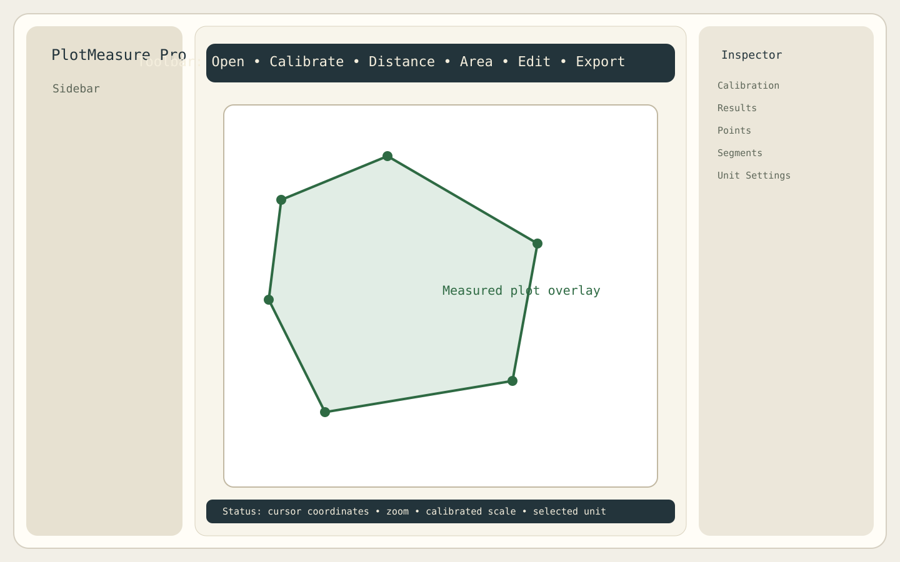

# PlotMeasure Pro

PlotMeasure Pro is a native macOS app for measuring plot and land area from cadastral, survey, and revisional map PDFs. It uses `SwiftUI` and `PDFKit`, stores geometry in PDF page coordinates, supports scale calibration, and exports annotated reports for land-measurement workflows.

## Download

- Latest release: [v1.0.0](https://github.com/tanik-kumar/plot-measure-pro/releases/tag/v1.0.0)
- Package asset: `PlotMeasure-Pro-v1.0.0.zip`
- Target platform: macOS 13+

## Install

1. Download `PlotMeasure-Pro-v1.0.0.zip` from the releases page.
2. Extract `Plot Measure Pro.app`.
3. Move it to `/Applications` if you want a standard install.
4. Open the app.

Current release note:
- this build is ad hoc signed, not Developer ID notarized
- macOS Gatekeeper may ask you to confirm opening it on first launch

## Key features

- Open scanned or vector cadastral, survey, and revisional map PDFs
- Calibrate by manual distance, `1:N` ratio, map scale, or visible scale bar
- Measure distance, path length, polygon perimeter, and polygon area
- Store points in native PDF coordinates so zoom and pan do not affect accuracy
- Edit vertices by drag, insert, delete, and numeric coordinate update
- Export JSON, CSV, and annotated PDF outputs
- Show results in `sq ft`, `sq m`, `acre`, `hectare`, `decimal`, `bigha`, `kattha`, and `dhur`
- Support OCR-assisted scale suggestions and edge snapping for scanned maps

## Preview



## v1.0.0 includes

- Native macOS UI with sidebar, PDF canvas, inspector, toolbar, and status bar
- PDF import, page navigation, page rotation, zoom, and pan
- Multiple calibration workflows
- Distance, path, and polygon measurement
- Polygon validity warning, centroid, and live overlay rendering
- Vertex editing with undo and redo
- OCR-assisted scale detection
- Edge snapping support
- Project save and load as JSON
- Annotated PDF, CSV, and JSON export

## Supported map and calibration workflows

Supported map types:
- cadastral maps
- survey maps
- revisional maps
- scanned map PDFs
- vector map PDFs

Calibration modes:
- manual two-point calibration
- `1:N` ratio calibration
- map scale entry such as `16 inches = 1 mile`
- scale-bar calibration from visible map conversion bars

## Example files

- Example project: [Examples/sample-project.plotmeasure.json](Examples/sample-project.plotmeasure.json)
- Example notes: [Examples/README.md](Examples/README.md)

## Folder structure

```text
PlotMeasurePro/
├── .github/
│   └── ISSUE_TEMPLATE/
├── CHANGELOG.md
├── Examples/
├── LICENSE
├── Package.swift
├── README.md
├── Docs/
│   └── plotmeasure-pro-preview.svg
├── Scripts/
│   └── package_app.sh
├── Sources/PlotMeasurePro/
│   ├── App/
│   ├── Models/
│   ├── Services/
│   ├── Utilities/
│   └── Views/
└── Tests/PlotMeasureProTests/
    └── GeometryAndCalibrationTests.swift
```

## Build and run

### Xcode

1. Open `Package.swift` in Xcode 16 or newer.
2. Select the `PlotMeasurePro` executable scheme.
3. Run on macOS.

### Command line

The local sandbox in this environment requires `--disable-sandbox` for SwiftPM. On a normal local machine you usually do not need that flag.

```bash
cd PlotMeasurePro
SWIFT_MODULECACHE_PATH=/tmp/plotmeasure-module-cache \
CLANG_MODULE_CACHE_PATH=/tmp/plotmeasure-module-cache \
swift build --disable-sandbox --scratch-path /tmp/plotmeasure-scratch
swift run --disable-sandbox PlotMeasurePro
```

### Tests

```bash
cd PlotMeasurePro
SWIFT_MODULECACHE_PATH=/tmp/plotmeasure-module-cache \
CLANG_MODULE_CACHE_PATH=/tmp/plotmeasure-module-cache \
swift test --disable-sandbox --scratch-path /tmp/plotmeasure-test-scratch
```

## Packaging the macOS app

```bash
cd PlotMeasurePro
./Scripts/package_app.sh
```

This generates:
- `dist/Plot Measure Pro.app`
- `dist/PlotMeasure-Pro-v1.0.0.zip`

## How calibration works

The app stores every clicked vertex in native PDF page coordinates, not screen coordinates. Zooming and panning never change the actual measurement geometry.

### Manual calibration

1. Click two known points on the map or printed scale bar.
2. Enter the real-world distance and unit.
3. The app computes:

```text
metersPerPDFPoint = realWorldMeters / pdfCoordinateDistance
```

Every later segment length becomes:

```text
realWorldMeters = pdfDistance * metersPerPDFPoint
```

Polygon area becomes:

```text
realWorldAreaSqM = pdfArea * (metersPerPDFPoint ^ 2)
```

### Ratio calibration (`1:N`)

PDF pages use printer points, where `72 PDF points = 1 inch` on the page. For a true `1:N` map:

```text
metersPerPDFPoint = (0.0254 / 72) * N
```

This is best when the PDF reflects the printed scale accurately. For scanned maps, manual calibration is often more reliable.

### Map-scale calibration (`16 inches = 1 mile`)

The app converts both paper distance and ground distance to meters, derives the ratio, and applies the same `1:N` formula internally.

## Known limitations

- Calibration accuracy depends on scan quality and the reliability of the printed scale.
- Local land-unit standards can vary by district or state, so regional unit settings may need adjustment.
- Current release is packaged for macOS only.
- GIS export formats such as GeoJSON or shapefile are not included in `v1.0.0`.
- This public repo does not bundle any real survey or cadastral source PDFs.

## Performance notes

- Cache page edge maps per page and invalidate only on rotation or document change.
- Add thumbnail or raster caches for OCR and snap assists rather than re-rendering on every request.
- Move OCR and edge-map generation onto detached background tasks with cancellation.
- For very dense polygons, cache measurement analysis until points change.
- For very large documents, keep only the active page overlay data resident and lazy-load the rest.

## Packaging and signing guidance

For distribution beyond local testing:

1. Sign the app:

```bash
codesign --force --deep --sign "Developer ID Application: YOUR NAME" "dist/Plot Measure Pro.app"
```

2. Verify the signature:

```bash
codesign --verify --deep --strict --verbose=2 "dist/Plot Measure Pro.app"
spctl --assess --type execute --verbose "dist/Plot Measure Pro.app"
```

3. Notarize with `notarytool`, then staple the ticket.

## Changelog

- [CHANGELOG.md](CHANGELOG.md)

## Roadmap

- Assisted boundary tracing from detected edges
- Loupe or magnifier around the pointer
- Multi-plot comparison workflows
- GIS export formats such as GeoJSON and shapefile handoff
- Optional OpenCV integration for stronger edge and contour extraction
- Richer project library and batch reporting
